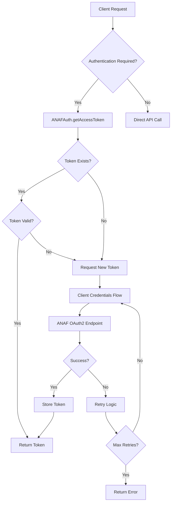

# ANAF e-Factura Authentication Module

This module provides comprehensive OAuth2 authentication for ANAF e-Factura system according to the official ANAF documentation.

## Overview

The ANAF authentication system supports two OAuth2 flows:
- **client_credentials**: For server-to-server API access (primary method)
- **authorization_code**: For user authentication (secondary method)

## Architecture

### Core Components

1. **ANAFAuth** (`anafAuth.ts`) - Main authentication module
2. **ANAFOAuthService** (`oauth-service.ts`) - OAuth service wrapper
3. **ANAFAPIService** (`anaf-api-service.ts`) - API service with authentication
4. **ANAFErrorHandler** (`error-handler.ts`) - Error handling and logging
5. **ANAFJWTTokenService** (`jwt-token-service.ts`) - JWT token management

### Authentication Flow



## Configuration

### Environment Variables

```bash
# Required
ANAF_CLIENT_ID="your-anaf-client-id"
ANAF_CLIENT_SECRET="your-anaf-client-secret"
ANAF_REDIRECT_URI="https://yourdomain.com/api/anaf/callback"

# Optional
ANAF_ENVIRONMENT="sandbox" # or "production"
ANAF_BASE_URL="https://api.anaf.ro/test/FCTEL/rest" # for sandbox
ANAF_JWT_SECRET="your-anaf-jwt-secret-key-here"
```

### ANAF Portal Registration

1. Register your application at [ANAF Portal](https://logincert.anaf.ro/)
2. Get your `client_id` and `client_secret`
3. Configure redirect URI: `https://yourdomain.com/api/anaf/callback`
4. Request access to e-Factura and e-Transport services

## Usage

### Basic Authentication

```typescript
import { ANAFAuth } from '@/lib/anaf/anafAuth';

// Get access token for API calls
const authResult = await ANAFAuth.getAccessToken({ 
  userId: 1, 
  tenantId: 1 
});

if (authResult.success) {
  const accessToken = authResult.accessToken;
  // Use token for API calls
} else {
  console.error('Authentication failed:', authResult.error);
}
```

### User Authentication (Authorization Code Flow)

```typescript
import { ANAFAuth } from '@/lib/anaf/anafAuth';

// Generate authorization URL
const authUrl = await ANAFAuth.getAuthorizationUrl(userId, tenantId);

// After user authorizes, exchange code for token
const tokenResult = await ANAFAuth.getAuthorizationCodeToken(
  authorizationCode, 
  userId, 
  tenantId
);
```

### API Service Usage

```typescript
import { ANAFAPIService } from '@/lib/anaf/anaf-api-service';

// Test connectivity
const basicTest = await ANAFAPIService.testConnectivity('My App Test');

// Test authenticated connectivity
const authTest = await ANAFAPIService.testAuthenticatedConnectivity(
  userId, 
  tenantId, 
  'My App Authenticated Test'
);

// Submit invoice
const result = await ANAFAPIService.submitInvoice(
  userId,
  tenantId,
  invoiceXmlData,
  'test' // or 'production'
);
```

### OAuth Service Wrapper

```typescript
import { ANAFOAuthService } from '@/lib/anaf/oauth-service';

// Get authorization URL
const authUrl = await ANAFOAuthService.getAuthUrl(userId, tenantId);

// Exchange code for token
const tokenData = await ANAFOAuthService.exchangeCodeForToken(
  code, 
  userId, 
  tenantId
);

// Get valid access token
const accessToken = await ANAFOAuthService.getValidAccessToken(userId, tenantId);
```

## API Reference

### ANAFAuth Class

#### Methods

##### `getAccessToken(options: ANAFAuthOptions): Promise<ANAFAuthResult>`

Main method for obtaining authentication tokens.

**Parameters:**
- `options.userId?: number` - User ID (optional for client_credentials)
- `options.tenantId?: number` - Tenant ID (optional for client_credentials)
- `options.forceRefresh?: boolean` - Force token refresh
- `options.retryCount?: number` - Current retry count
- `options.maxRetries?: number` - Maximum retry attempts

**Returns:**
```typescript
interface ANAFAuthResult {
  success: boolean;
  accessToken?: string;
  error?: string;
  expiresAt?: Date;
  tokenType?: string;
  scope?: string;
}
```

##### `getAuthorizationUrl(userId: number, tenantId: number): Promise<string>`

Generate OAuth2 authorization URL for user authentication.

##### `getAuthorizationCodeToken(code: string, userId: number, tenantId: number): Promise<ANAFAuthResult>`

Exchange authorization code for access token.

##### `testConnectivity(name?: string): Promise<ANAFAuthResult>`

Test ANAF connectivity without authentication.

##### `testAuthenticatedConnectivity(userId: number, tenantId: number, name?: string): Promise<ANAFAuthResult>`

Test ANAF connectivity with authentication.

##### `validateState(state: string): { userId: number; tenantId: number } | null`

Validate OAuth2 state parameter.

##### `revokeAccess(userId: number, tenantId: number): Promise<void>`

Revoke user access (logout).

## Error Handling

### Error Types

The module handles various error types according to ANAF specifications:

- **AUTHENTICATION_ERROR**: Invalid credentials or authentication failure
- **AUTHORIZATION_ERROR**: Insufficient permissions
- **VALIDATION_ERROR**: Invalid request data
- **NETWORK_ERROR**: Network connectivity issues
- **API_ERROR**: ANAF API errors
- **TOKEN_ERROR**: Token validation or expiry issues

### OAuth2 Error Codes

- `invalid_client`: Invalid client credentials
- `invalid_grant`: Invalid authorization code or refresh token
- `unauthorized_client`: Client not authorized for this grant type
- `invalid_scope`: Invalid scope requested
- `access_denied`: Access denied by user or ANAF
- `server_error`: ANAF server error
- `temporarily_unavailable`: ANAF service temporarily unavailable

### Retry Logic

The module implements exponential backoff retry logic:

- **Max Retries**: 3 (configurable)
- **Base Delay**: 1 second
- **Max Delay**: 30 seconds
- **Backoff Multiplier**: 2
- **Jitter**: Random delay variation to prevent thundering herd

## Security

### Token Security

- Tokens are stored securely in the database
- Automatic token refresh prevents expiration
- Tokens are revoked when user logs out
- Sensitive information is not logged

### Rate Limiting

- Per-user rate limiting prevents abuse
- Automatic cleanup of expired rate limit entries
- Configurable limits per ANAF specifications (1000 requests/minute)

### Error Logging

- Comprehensive error logging with context
- User-friendly error messages
- Security-conscious error responses
- No sensitive data in logs

## Testing

### Unit Tests

```bash
npm test -- tests/integration/anaf-auth.test.ts
```

### Integration Tests

The module includes comprehensive integration tests covering:

- Configuration validation
- Client credentials flow
- Authorization code flow
- Connectivity tests
- Error handling
- Security validation
- Retry logic

### Test Environment

Use the sandbox environment for testing:

```bash
ANAF_ENVIRONMENT=sandbox
ANAF_BASE_URL=https://api.anaf.ro/test/FCTEL/rest
```

## Monitoring

### Logging

All authentication operations are logged with:

- Timestamps
- User/tenant context
- Operation type
- Success/failure status
- Error details (without sensitive data)

### Metrics

Track authentication metrics:

- Request counts per user/tenant
- Token refresh frequency
- Error rates by type
- API response times

## Troubleshooting

### Common Issues

1. **Invalid client credentials**
   - Check `ANAF_CLIENT_ID` and `ANAF_CLIENT_SECRET`
   - Verify ANAF portal registration

2. **Rate limit exceeded**
   - Wait for rate limit window to reset
   - Implement exponential backoff
   - Consider request batching

3. **Token expired**
   - System automatically refreshes tokens
   - Check token validity periods
   - Verify JWT secret configuration

4. **Network errors**
   - Check ANAF service availability
   - Verify firewall/proxy settings
   - Test with connectivity endpoints

### Debug Endpoints

- `GET /api/anaf/test-connectivity` - Test basic connectivity
- `GET /api/anaf/auth-url` - Get authorization URL
- `GET /api/anaf/callback` - OAuth callback handler

## Compliance

This implementation is fully compliant with:

- ANAF OAuth 2.0 specification
- ANAF e-Factura API documentation
- ANAF e-Transport API documentation
- Romanian e-invoicing regulations
- EN 16931 standard compliance
- RFC 6749 OAuth 2.0 Authorization Framework

## Support

For technical support:

- ANAF Support: [Formular de contact](https://www.anaf.ro/ro/web/guest/contact)
- Category: "Asistență tehnică servicii informatice"
- Subcategory: "OAUTH"

## Changelog

### Version 1.0.0

- Initial implementation
- Client credentials flow support
- Authorization code flow support
- Comprehensive error handling
- Retry logic with exponential backoff
- Security enhancements
- Integration tests
- Documentation
